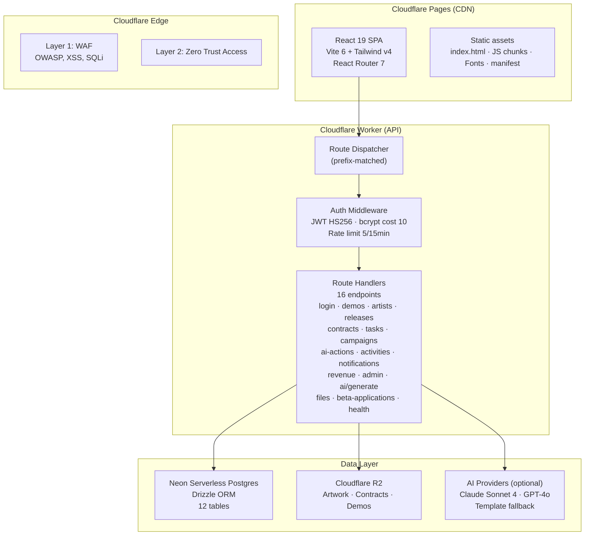
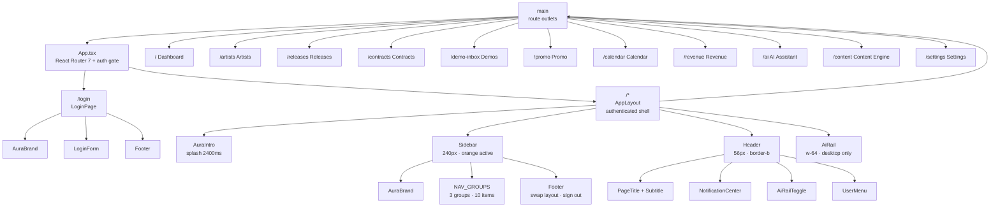
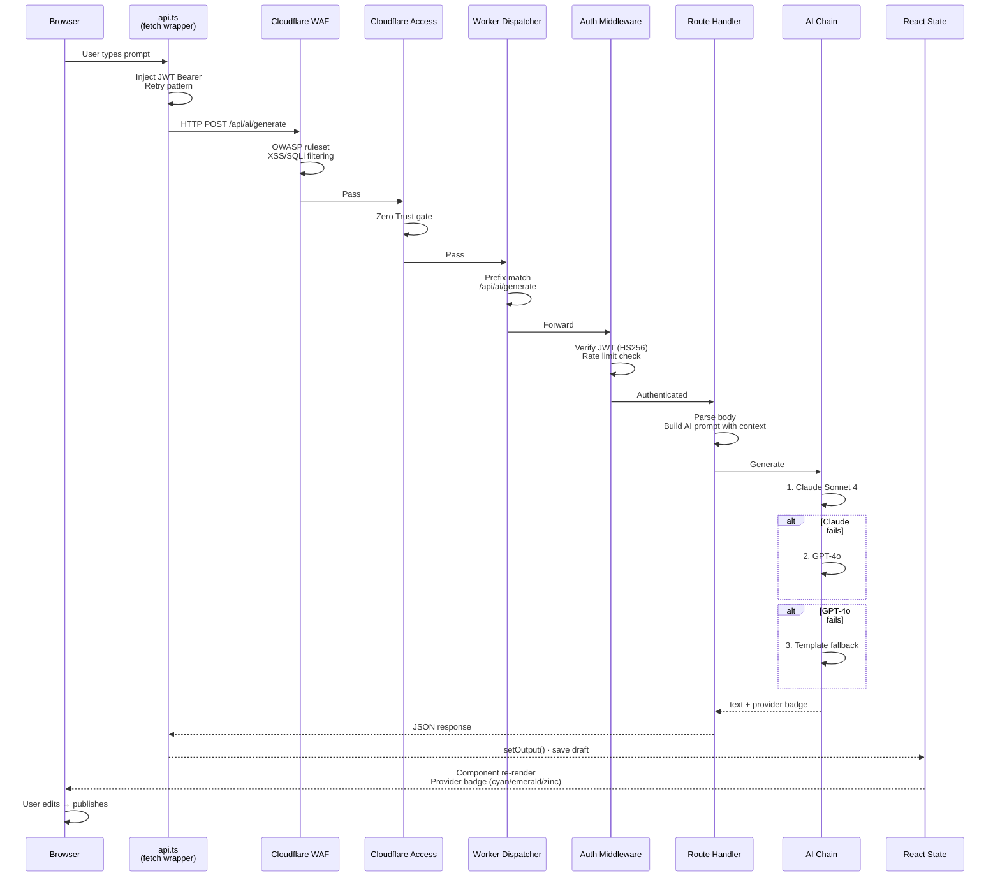
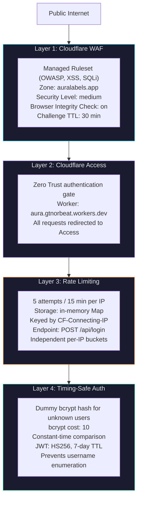
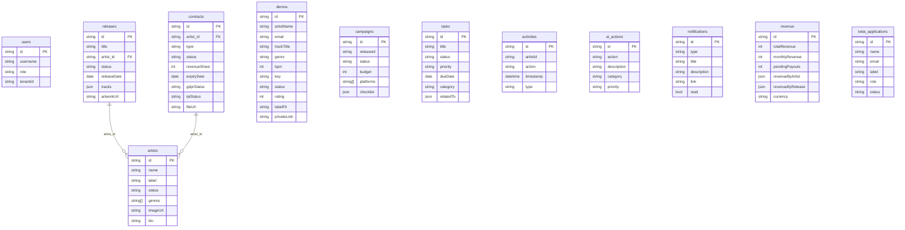
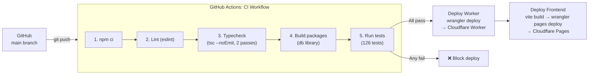

# AURA — Startup & Investor Brief

> **A&R Utility & Revenue Assistant**
>
> The operational nervous system for independent record labels.

---

## Executive Summary

**AURA** is a premium, AI-powered SaaS platform that replaces the fragmented spreadsheets, email threads, and manual workflows independent record labels rely on today. It centralizes every facet of label operations — artist roster management, release pipelines, contract lifecycle, demo inbox triage, promo campaign coordination, revenue tracking, and AI-assisted content generation — into a single, dark, intentionally designed cockpit.

Built for **ORBEAT Records (ORB001)** as the launch tenant, AURA is in production at [https://auralabels.app](https://auralabels.app) with 126 passing tests, a 12-table Postgres schema, and a defence-in-depth security model spanning five layers.

### Key Facts

| Dimension | Status |
|-----------|--------|
| **Product** | Live, production-deployed SPA + API |
| **Launch Tenant** | ORBEAT Records (ORB001) |
| **Tech Stack** | React 19, Cloudflare Workers, Neon Postgres, Drizzle ORM |
| **Architecture** | Multi-tenant SaaS posture — every tenant starts empty, onboarded via UI |
| **Test Coverage** | 126 tests, zero failures |
| **Security** | 4-layer defence: WAF → Zero Trust Access → Rate Limiting → Timing-safe Auth |
| **AI Pipeline** | Claude Sonnet → GPT-4o → template fallback (either key optional) |
| **Deploy** | GitHub Actions CI/CD, auto-deploy on push to `main` |

---

## The Problem

Independent record labels manage **everything by hand**:

- **Demo submissions** arrive via email, Instagram DMs, SoundCloud links, and WhatsApp. There's no intake pipeline — most are lost.
- **Artist rosters** live in spreadsheets. Social links, missing bio info, and contract status drift out of sync weekly.
- **Release pipelines** are tracked in Notion, Trello, or a whiteboard. No two releases follow the same checklist.
- **Contracts** sit in Dropbox folders. Nobody knows which are expiring, which artists owe deliverables, or whether GDPR consent is current.
- **Revenue** is a quarterly CSV export from distributors. Labels can't see monthly trends, artist-level breakdowns, or pending payouts without stitching together three tools.
- **Promo campaigns** are planned in Google Docs. Content deadlines are forgotten. Platform-specific copy is rewritten from scratch for every release.
- **AI tools exist**, but they're disconnected — ChatGPT for copy, Claude for strategy, templates for consistency. Nobody has wired them into the label's actual data (artist names, release metadata, contract terms).

The result: label managers spend 60–70% of their time on operational overhead, not on discovering talent and growing their roster.

---

## What AURA Does

AURA replaces this chaos with **one unified surface**. Every function a label needs lives behind a dark, professional dashboard built for daily use in a studio environment.

### Ten Operational Surfaces

| Surface | What it replaces |
|---------|-----------------|
| **Dashboard** (`/`) | Today's priorities, revenue overview, active campaigns, demo summary, deadlines — a real-time ops cockpit |
| **Artists** (`/artists`) | Roster CRUD with social links, profile completeness signals, missing-info flags |
| **Releases** (`/releases`) | Release pipeline with readiness checklist, artwork tiles, track lists, launch checklists |
| **Contracts** (`/contracts`) | Four contract types (exclusive/non-exclusive/distribution/licensing) with revenue share, expiry tracking, GDPR/IPI status |
| **Demo Inbox** (`/demo-inbox`) | Public webhook intake (Make.com compatible) → rate → label-fit → interested/rejected workflow |
| **Promo Campaigns** (`/promo`) | Release-driven campaigns with platform targeting, budget tracking, content checklists |
| **Calendar** (`/calendar`) | Entity-linked tasks with due dates, overdue flags, priority levels |
| **Revenue** (`/revenue`) | Monthly trends, artist/release proportion bars, pending payouts in EUR |
| **AI Assistant** (`/ai`) | Prompt-driven copy and strategy generation wired to real artist/release/contract context |
| **Content Engine** (`/content`) | Platform-aware generation (Instagram, Spotify, TikTok, Beatport, YouTube, Press, Radio, Email) with per-channel char caps and guidance injected into prompts |
| **Settings** (`/settings`) | Label config, AI provider keys (OpenRouter + Workers AI), user/session management, one global Save |

### The AI Pipeline

AURA's AI generation (`POST /api/ai/generate`) chains three tiers:

1. **Claude Sonnet 4** — primary engine (cyan badge)
2. **GPT-4o** — fallback (emerald badge)
3. **Template** — zero-key fallback with platform-aware char caps (zinc badge)

The Content Engine injects per-platform rules (Instagram = 220 chars, Spotify = 500, Press = no cap) into both the LLM system prompt and the template fallback. Either AI key is optional — the app degrades gracefully.

---

## Market Opportunity

### The Independent Label Landscape

- **~10,000+ independent record labels** operate globally
- The vast majority are teams of 2–10 people with no dedicated operations tooling
- Industry revenue is growing (streaming + vinyl resurgence), but margins are thin — operational efficiency is the difference between profitability and folding
- **AI adoption in music is accelerating** (Spotify's AI DJ, AI mastering services, AI-generated artwork), but **label management software is 15 years behind**

### Competitive Landscape

| Competitor | What they do | Why AURA wins |
|-----------|-------------|---------------|
| Spreadsheets + Email | Manual tracking | Unified surface, real-time data, zero context-switching |
| Notion / Trello / Asana | Generic project management | Purpose-built for label workflows — release checklists, contract expiry, demo triage are first-class, not templates |
| Distributor dashboards (DistroKid, TuneCore, Amuse) | Release distribution + basic royalties | AURA is label operations, not distribution. Works alongside distributors |
| ChatGPT / Claude (raw) | General AI | AURA's AI is wired to the label's actual data — artist names, release metadata, contract terms — and produces platform-aware output |
| Record label CRMs (Backstage, LabelGrid) | Legacy enterprise tools | AURA is modern, fast, AI-native, and priced for indies |

### Target Customer

**Primary:** Independent label managers and A&Rs running rosters of 5–50 artists, releasing 10–100+ tracks/year, managing contracts, demos, and promo campaigns.

**Expansion:** Independent artists self-managing (artist-as-label), boutique PR agencies servicing multiple labels, sync licensing teams.

---

## Technical Architecture

### System Overview



### Frontend Component Architecture



### Data Flow (Request Lifecycle)



### Security Architecture (4-Layer Defence)



### Database Schema (12 Tables)



### CI/CD Pipeline



### Production Stack

```
auralabels.app
  ├── Frontend: React 19 SPA (Vite 6 + Tailwind v4 + React Router 7)
  │   └── Deployed via Cloudflare Pages (global edge)
  │
  └── API: Cloudflare Worker (prefix-matched route dispatching)
      ├── Auth: JWT (HS256, 7-day TTL) + bcrypt (cost 10)
      ├── Database: Neon Serverless Postgres (Drizzle ORM, 12 tables)
      ├── Storage: Cloudflare R2 (artwork, contracts, demos)
      └── AI: OpenRouter + Workers AI chained with template fallback
```

### Multi-Tenant Posture

AURA is built as a SaaS platform from day one. The database doctrine is "every tenant starts empty" — no fixture data, no hardcoded demo content. New operators onboard entirely through the UI. This is enforced by regression tests that fail if mock data is reintroduced.

### Security (4-Layer Defence-In-Depth)

| Layer | Mechanism |
|-------|-----------|
| **1. WAF** | Cloudflare Managed Ruleset (OWASP, XSS, SQLi) on zone `auralabels.app` |
| **2. Zero Trust Access** | Cloudflare Access gate in front of the Worker — all requests authenticated |
| **3. Rate Limiting** | 5 attempts/15 min per IP (in-memory Map, `CF-Connecting-IP`) |
| **4. Timing-Safe Auth** | Dummy bcrypt hash for non-existent users prevents username enumeration |

### Demoing & Scoping the Product

A full interactive walkthrough of every surface is available via our **screen recording** at the key `HANDOFF.md` link. Additionally, **live "how-to" documentation** is published at `apps/auralabels/docs/AURA_USER_GUIDE.md` (this repository), covering sign-in, roster onboarding, demo triage, release pipelines, contract lifecycle, promo campaigns, revenue analysis, and AI-assisted content generation — a step-by-step manual any label manager can follow.

---

## Traction & Milestones

| Milestone | Status |
|-----------|--------|
| Production deployment (auralabels.app) | ✅ Live |
| ORBEAT Records onboarded as launch tenant | ✅ Active |
| 12-table Postgres schema with full CRUD | ✅ |
| AI pipeline (Claude → GPT-4o → template) | ✅ |
| 126 tests, zero failures | ✅ |
| 4-layer security model deployed | ✅ |
| Mobile-first strategy documented | ✅ Phase 1 ready |
| PWA installability | 🔲 Phase 6 |
| Multi-tenant onboarding flow | 🔲 Next |
| Stripe billing integration | 🔲 Roadmap |

---

## Roadmap

### Phase 1 — Mobile-First Chrome (CSS-only, 1 file touched)
- Bottom-tab bar for phone navigation
- Hero watermark recompute for small viewports
- Touch-target audit (44×44px minimum)

### Phase 2 — Multi-Tenant Onboarding
- Self-service tenant creation
- Multi-tenancy at the database layer (tenant-aware queries)
- Admin panel for tenant management

### Phase 3 — Monetization
- Stripe subscription integration
- Tiered pricing (Free / Pro / Label)
- Usage-based AI credits

### Phase 4 — Distribution Integration
- Direct distributor API connections (DistroKid, TuneCore, Amuse)
- Automated revenue ingestion
- Release submission from AURA to distributor

### Phase 5 — Discovery & Network
- Artist discovery tools (cross-label analytics)
- Demo submission marketplace (labels can discover unsigned talent)
- Sync licensing pipeline

---

## Team & Context

AURA is built and maintained as a focused product. The codebase follows strict conventions: TypeScript strict mode, zero `any` casts, 126 regression tests, and a documented design system (DESIGN.md) with named rules governing every color, typeface, and interaction pattern.

**Production URL:** [https://auralabels.app](https://auralabels.app)

**Tech Stack:** React 19 · Cloudflare Workers · Neon Serverless Postgres · Drizzle ORM · Tailwind CSS v4 · GitHub Actions CI/CD

**Contact & Documentation:** See `README.md`, `PRODUCT.md`, `DESIGN.md`, and `AGENTS.md` in this repository for deep technical documentation.
